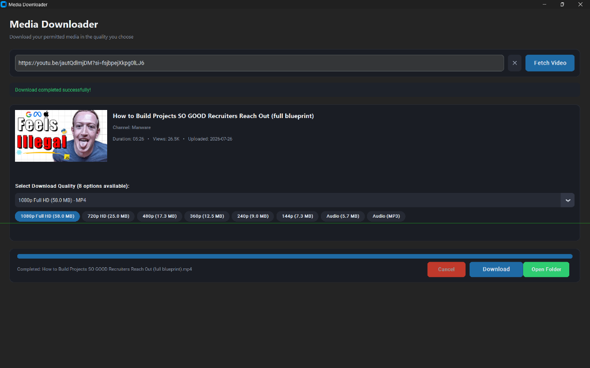

# Media Downloader

A modern desktop media downloader built with Python, CustomTkinter, yt-dlp, and FFmpeg. Supports downloading single videos, YouTube Shorts, Instagram Reels, and full YouTube Playlists in high quality.

[](https://www.python.org/)
[](https://github.com/TomSchimansky/CustomTkinter)
[](https://github.com/yt-dlp/yt-dlp)
[](https://ffmpeg.org/)
[](https://microsoft.com)

---

## Table of Contents
- [Features](#features)
- [Supported Platforms](#supported-platforms)
- [Screenshots](#screenshots)
- [Quick Start Guide](#quick-start-guide)
- [Project Structure](#project-structure)
- [How It Works](#how-it-works)

---

## Features

- **Full YouTube Playlist Support**: Download entire playlists with interactive video selection, item checkboxes, and per-video quality choices.
- **1-Click Master Quality Selector**: Set desired resolution (`1080p Full HD`, `720p HD`, `480p`, `Audio MP3`) across all playlist videos at once.
- **Dedicated Playlist Folders**: Automatically organizes downloads into named playlist subfolders (`downloads/Playlist Title/`) with chronological index prefixes (`01 - Intro.mp4`, `02 - Variables.mp4`).
- **Original Audio Preservation**: Intelligent audio track selection prioritizes native creator voice tracks (such as Hindi Original) over AI-generated dubbed audio.
- **Universal Player Compatibility**: Automatically pairs H.264 Video + AAC Audio for smooth playback on Windows Media Player, QuickTime, mobile devices, and TVs.
- **Visual Thumbnail Previews**: Real-time thumbnail previews for single videos and visual row thumbnails in the playlist table.
- **Audio & MP3 Extraction**: Download standalone audio streams or convert directly to high-bitrate MP3 files.
- **Per-Video Progress Bar**: Individual 0% to 100% progress tracking per video item with download speed and ETA.
- **Responsive Dark Theme**: Built on CustomTkinter with a scrollable container for all screen resolutions.

---

## Supported Platforms

| Platform | Supported Content | Available Qualities |
| :--- | :--- | :--- |
| **YouTube** | Long-form Videos, YouTube Shorts, & Full Playlists | 1440p QHD, 1080p Full HD, 720p HD, 480p, 360p, 240p, M4A, MP3 |
| **Instagram** | Reels & Video Posts | HD MP4 (H.264 + AAC) |

---

## Screenshots

### Main Application Interface


*Main application interface showing video metadata, quality selection badges, and live progress.*

### Compact Responsive Layout


*Responsive scrollable layout for smaller display resolutions.*

---

## Quick Start Guide

### Option 1: Command Line

1. **Clone the repository**:
   ```bash
   git clone <repository-url>
   cd <repository-folder>
   ```

2. **Install dependencies**:
   ```bash
   pip install -r requirements.txt
   ```

3. **Launch the application**:
   ```bash
   python run.py
   ```

---

### Option 2: Double-Click Setup (Beginner Friendly)

1. Extract the downloaded project ZIP file.
2. Double-click **`setup.py`** to automatically install required packages and set up runtime folders.
3. Double-click **`run.py`** to launch Media Downloader.

---

## Project Structure

```text
media-downloader/
├── run.py                 # Main application entry point
├── setup.py               # Automated setup & installer script
├── requirements.txt       # Python package dependencies
├── README.md              # Project documentation
├── .gitignore             # Git ignore settings
│
├── app/                   # Source code
│   ├── config.py          # App configuration & UI theme colors
│   ├── downloader.py      # Multi-threaded download runner & progress hooks
│   ├── gui.py             # CustomTkinter interface & views
│   ├── metadata.py        # Metadata extraction & format normalization engine
│   ├── models.py          # Data models (VideoInfo, PlaylistInfo, PlaylistItem)
│   └── utils.py           # Helper utilities (FFmpeg locator, formatters)
│
└── assets/                # README screenshots & images
```

---

## How It Works

1. **Metadata Engine**: Uses `yt-dlp` to extract media formats without downloading files.
2. **Format Normalization**: Filters duplicate streams, prioritizes H.264 video + AAC audio, and sorts quality options.
3. **Multi-Threading**: Runs downloads on background threads to keep the CustomTkinter GUI responsive.
4. **Stream Merging**: Uses FFmpeg to combine video and audio streams into standard `.mp4` containers.
