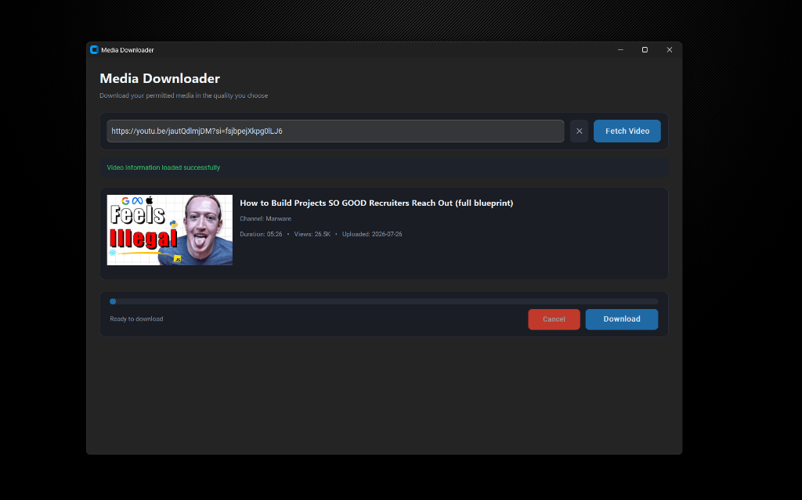

# Media Downloader

A modern desktop application for fetching metadata and downloading media in selectable video and audio qualities. Built with Python, CustomTkinter, yt-dlp, and FFmpeg.

## Screenshots


*Main application interface showing fetched video metadata, quality selection badges, and real-time download progress.*



*Responsive layout on compact displays with vertical scrolling.*

## Overview

Media Downloader provides a graphical interface for `yt-dlp`. Instead of running command-line instructions to inspect formats or stream IDs, you paste a media URL to fetch available resolutions, select your preferred quality, and download the media file directly to a local directory.

The application automatically handles FFmpeg detection to combine high-resolution video and audio streams into single MP4 files.

## Features

- **Modern Dark UI**: Desktop interface built with `CustomTkinter` and `Pillow`.
- **Metadata Extraction**: Fetches thumbnail preview, title, channel name, duration, view count, and upload date.
- **Automatic Quality Detection**: Parses available resolutions from 1440p QHD and 1080p Full HD down to 144p.
- **Quick-Select Badges**: Dropdown selector and quick-click resolution pills with file size estimates.
- **Audio Download & MP3 Conversion**: Extract audio streams directly as M4A/WEBM or convert to MP3.
- **Real-Time Progress Stats**: Shows percentage, downloaded MB / total MB, current speed (KB/s or MB/s), and ETA.
- **FFmpeg Stream Merging**: Combines separate high-res video and audio streams into single files.
- **Responsive Layout**: Scrollable content container ensures controls remain accessible on smaller displays.
- **Local Download Folder**: Automatically saves output to `downloads/` with a one-click **Open Folder** button.

## How It Works

```text
URL Input
  ↓
yt-dlp metadata extraction
  ↓
Available formats & sizes populated
  ↓
User selects quality (e.g. 1080p Full HD)
  ↓
yt-dlp downloads video and audio streams
  ↓
FFmpeg merges streams into final file
  ↓
Saved to downloads/
```

YouTube serves high-resolution formats (such as 1080p or 1440p) as separate video-only and audio-only streams. Media Downloader fetches both streams and uses FFmpeg to merge them into a single playable MP4 video.

## Installation

### Prerequisites

- **Python 3.10+** (Python 3.10, 3.11, 3.12, or 3.13)
- **Git**

### Step-by-Step Setup

1. **Clone the repository**:
   ```bash
   git clone <repository-url>
   cd <repository-folder>
   ```

2. **Create a virtual environment**:
   ```bash
   python -m venv .venv
   ```

3. **Activate the virtual environment**:
   - **Windows (Command Prompt / PowerShell)**:
     ```cmd
     .venv\Scripts\activate
     ```
   - **macOS / Linux**:
     ```bash
     source .venv/bin/activate
     ```

4. **Install dependencies**:
   ```bash
   python -m pip install --upgrade pip
   pip install -r requirements.txt
   ```

5. **Run the application**:
   ```bash
   python app.py
   ```

## Quick Start

```bash
git clone <repository-url>
cd <repository-folder>
python -m venv .venv
.venv\Scripts\activate
pip install -r requirements.txt
python app.py
```

## FFmpeg Setup

FFmpeg is required to:
- Merge separate video and audio streams for 1080p+ resolutions.
- Convert audio streams to MP3 format.

### Automatic FFmpeg Resolution

The application looks for FFmpeg in the following order:
1. **Project-local directory**: `./ffmpeg/bin`, `./ffmpeg`, or `./ffmpeg_bin`
2. **System PATH**: Installed system-wide (`ffmpeg` command)
3. **Python package fallback**: `imageio-ffmpeg` (installed automatically via `requirements.txt`)

You do not need to manually download or configure FFmpeg on Windows if `imageio-ffmpeg` is installed.

## Usage

1. Launch the application with `python app.py`.
2. Paste a supported media URL into the input field.
3. Click **Fetch Video**.
4. Review the video title, duration, and thumbnail preview.
5. Select your preferred resolution from the quality dropdown or click a quick-select quality badge.
6. Click **Download** to start downloading.
7. Monitor real-time progress (MB downloaded, percentage, speed, and ETA).
8. Once finished, click **Open Folder** to open the target output directory.

## Download Location

All downloaded media files are saved to:

```text
downloads/
```

This directory is created automatically inside the project root directory when the application starts.

## Available Quality Options

Qualities depend on what `yt-dlp` reports for each specific media URL. Typical options include:

- `1440p QHD`
- `1080p Full HD`
- `720p HD`
- `480p`
- `360p`
- `240p`
- `144p`
- `Audio Only (M4A / WEBM)`
- `Audio Only (MP3)`

If a video was uploaded with a maximum resolution of 720p, higher resolutions will not be listed.

## Responsive Interface

The interface features a scrollable content area (`CTkScrollableFrame`). If the application window is resized to a smaller height or opened on a lower-resolution display, scroll vertically inside the window to access all quality controls, progress stats, and buttons.

Maximizing the window provides a spacious view, but is not required to access any functionality.

## Project Structure

```text
media-downloader/
│
├── app.py                  # Main application entry point
├── requirements.txt        # Python package dependencies
├── README.md               # Repository documentation
├── LICENSE                 # MIT License file
├── CONTRIBUTING.md         # Contribution guidelines
├── .gitignore              # Git ignore rules
│
├── app/                    # Application source package
│   ├── __init__.py
│   ├── gui.py              # CustomTkinter interface layout & callbacks
│   ├── downloader.py       # Asynchronous yt-dlp download thread & hooks
│   ├── metadata.py         # yt-dlp metadata extraction & format parsing
│   ├── models.py           # Dataclasses (VideoInfo, FormatOption, Progress)
│   ├── utils.py            # Formatting helpers & FFmpeg resolution logic
│   └── config.py           # Path constants & theme palette settings
│
├── docs/                   # Additional documentation & screenshots
│   ├── FEATURES.md         # Complete feature specification
│   ├── TROUBLESHOOTING.md  # Detailed troubleshooting guide
│   └── screenshots/
│       ├── main-window.png
│       └── compact-window.png
│
├── downloads/              # Default output folder for media downloads
│   └── .gitkeep
│
└── logs/                   # Application log files
    └── .gitkeep
```

## Troubleshooting

For solutions to common setup and download issues, see the detailed [Troubleshooting Guide](docs/TROUBLESHOOTING.md).

Quick check for missing modules or extractor errors:

```bash
# Update yt-dlp to latest release
pip install -U yt-dlp
```

## Limitations

- **Platform Extraction**: Available resolutions and download speeds depend on source platform headers and user network connection.
- **Private Content**: Content requiring user login, authentication, or private permissions cannot be fetched directly.
- **Extractor Updates**: Streaming services regularly modify player logic. Keep `yt-dlp` updated if extraction fails.

## Updating yt-dlp

Keep `yt-dlp` updated to maintain extractor compatibility with video hosting sites:

```bash
pip install -U yt-dlp
```

To update all project dependencies:

```bash
pip install -U -r requirements.txt
```

## Legal / Responsible Usage

This project is intended for downloading content that you own, have permission to download, or that is legally available for download. Users are responsible for complying with applicable copyright laws and platform terms of service.

## License

This project is licensed under the [MIT License](LICENSE).
